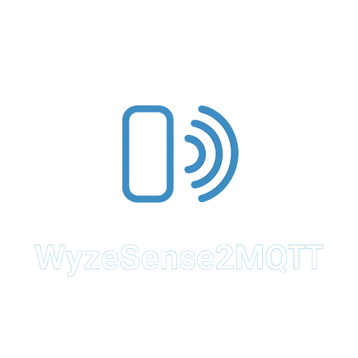

# WyzeSense2MQTT Addon Documentation

## Features

- Uses official `raetha/wyzesense2mqtt:devel` Docker image
- Supports configuring MQTT connection via addon options
- Exposes `/dev/hidraw0` USB device to container
- Supports MQTT discovery for Home Assistant

## Configuration Options

| Option             | Description                          | Default          |
|--------------------|------------------------------------|------------------|
| mqtt_host          | MQTT broker hostname or IP          | core-mosquitto   |
| mqtt_port          | MQTT broker port                    | 1883             |
| mqtt_username      | MQTT username                      | (empty)          |
| mqtt_password      | MQTT password                      | (empty)          |
| mqtt_client_id     | MQTT client ID                    | wyzesense2mqtt   |
| mqtt_clean_session | Clean session flag (true/false)    | false            |
| mqtt_keepalive     | MQTT keepalive seconds              | 60               |
| mqtt_qos           | MQTT QoS level (0, 1, 2)           | 2                |
| mqtt_retain        | MQTT retain flag (true/false)      | true             |
| self_topic_root    | MQTT topic root                    | wyzesense2mqtt   |
| hass_topic_root    | MQTT Home Assistant topic root    | homeassistant    |
| hass_discovery     | Enable Home Assistant discovery    | true             |
| publish_sensor_name| Publish sensor names                | true             |
| usb_dongle        | USB dongle device (e.g., auto)      | auto             |

## Installation

Add this repository URL in Supervisor Add-on Store → Repositories, then install the addon.

---

## Sensor Configuration

### How to use `sensors_config`

The `sensors_config` option lets you define your Wyze sensors in the Home Assistant addon config UI. Because the UI only supports single-line input, use an inline YAML list:

```
[{mac: "77C2A194", name: "Front Door", type: "door"}, {mac: "77D53275", name: "Garage Climate", type: "climate", humidity: true, temperature: true}]
```

- `mac`: Sensor MAC address (string, no colons)
- `name`: Friendly name for the sensor
- `type`: Sensor type (e.g., "door", "motion", "climate")
- You can add extra fields (e.g., `humidity: true`, `temperature: true`) for sensors that report more data.

The addon automatically converts this list to the format required by the backend service.

#### Example sensors_config for two sensors
```
[{mac: "77C2A194", name: "Front Door", type: "door"}, {mac: "77D53275", name: "Garage Climate", type: "climate", humidity: true, temperature: true}]
```

#### Resulting sensors.yaml (auto-generated)
```
77C2A194:
  name: "Front Door"
  type: "door"
77D53275:
  name: "Garage Climate"
  type: "climate"
  humidity: true
  temperature: true
```

### Notes
- You cannot use multi-line YAML in the config UI; always use the inline list format.
- All fields except `mac` and `name` are optional, but extra fields will be passed to the backend.
- If you need to edit the file directly, use standard YAML dictionary format as shown above.

---

## Troubleshooting

- If sensors do not appear, check that your `sensors_config` is valid inline YAML.
- If you see errors about `jq` or `yq`, make sure your Dockerfile installs both tools:
  - `RUN apk add --no-cache jq yq`
- If your addon doesn’t appear, try restarting Home Assistant Supervisor.
- Double-check your folder structure and file names (case sensitive).
- Check Supervisor logs for errors.

---

## Usage

### Pairing a Sensor
At this time only a single sensor can be properly paired at once. Repeat the steps below for each sensor:
1. Publish a blank message to the MQTT topic `self_topic_root/scan` (default: `wyzesense2mqtt/scan`).
2. Use the pin tool that came with your Wyze Sense sensors to press the reset switch on the side of the sensor to pair. Hold until the red LED blinks.

### Removing a Sensor
Publish a message containing the MAC to be removed to the MQTT topic `self_topic_root/remove` (default: `wyzesense2mqtt/remove`). The payload should look like `AABBCCDD` (the MAC address, no colons).

### Reload Sensors
If you've changed your `sensors.yaml` file while the gateway is running, you can trigger a reload without restarting the gateway or Docker container:
- Publish a blank message to the MQTT topic `self_topic_root/reload` (default: `wyzesense2mqtt/reload`).

### Command Line Tool
The `bridge_tool_cli.py` script can be used to interact with your bridge to perform a few simple functions. Make sure to specify the correct device for your environment:
```
python3 bridge_tool_cli.py --device /dev/hidraw0
```
Menu options:
- `L` - List paired sensors
- `P` - Pair new sensors
- `U` - Unpair sensor (e.g. `U AABBCCDD`)
- `F` - Fix invalid sensors (removes sensors with invalid MACs)

### Home Assistant Integration
Home Assistant simply needs to be configured with the MQTT broker that the gateway publishes topics to. Once configured, the MQTT integration will automatically add devices for each sensor along with entities for state, battery_level, and signal_strength. By default, entities will have a device_class of `opening` for contact sensors, `motion` for motion sensors, and `moisture` for leak sensors. They will be named for the sensor type and MAC, e.g. `Wyze Sense Contact Sensor AABBCCDD`. To adjust the device_class or set a custom name, update the `sensors.yaml` configuration file and restart WyzeSense2MQTT. For a comprehensive list of device classes, see the [Home Assistant binary_sensor documentation](https://www.home-assistant.io/integrations/binary_sensor/#device-class).

---

## Compatible Hardware

### Bridge Devices
- Wyze Sense Bridge (WHSB1)
- Neos Smart Bridge (N-LSP-US1) - Untested, but theoretically compatible

### Sensors
- Wyze Sense Bridge Sensors
  - Contact Sensor v1
  - Motion Sensor v1
- Neos Smart Sensors (untested)
  - Contact Sensor
  - Leak Sensor
  - Motion Sensor
- Wyze Sense Hub Sensors (unsupported/untested)
  - Entry Sensor v2 (WSES2)
  - Motion Sensor v2 (WSMS2)
  - Climate Sensor (WSCS1) - Coming Soon
  - Keypad (WSKP1) - Coming Soon
  - Leak Sensor (WSLS1) - Coming Soon

---
